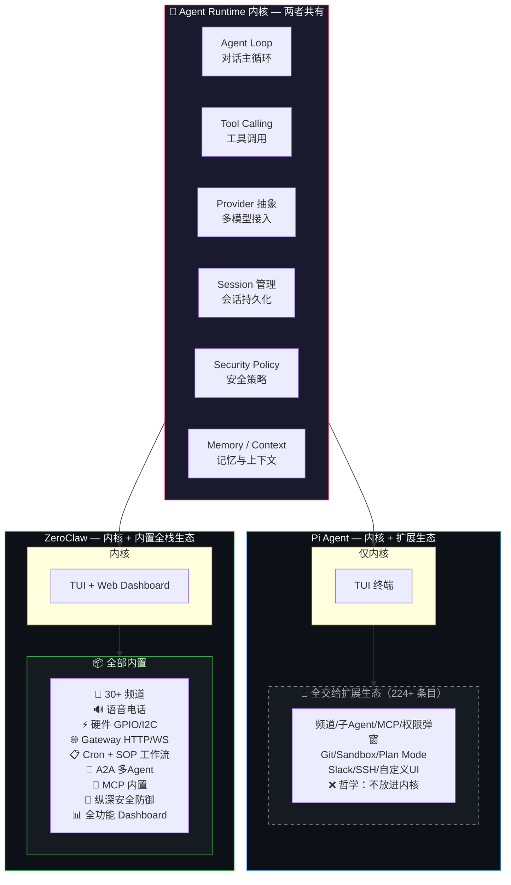
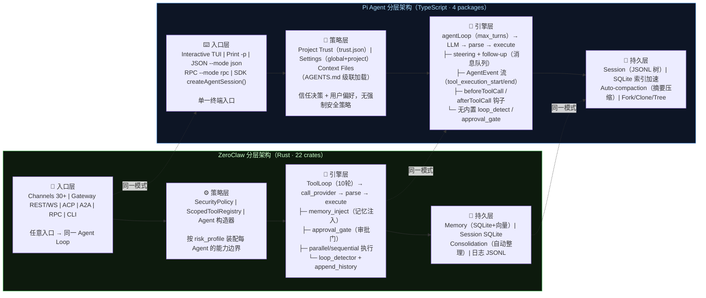
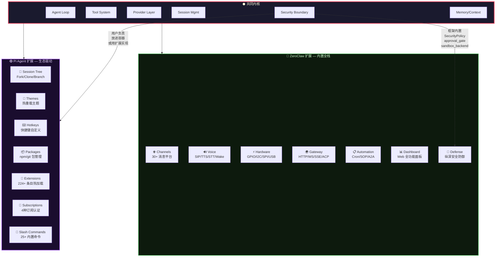
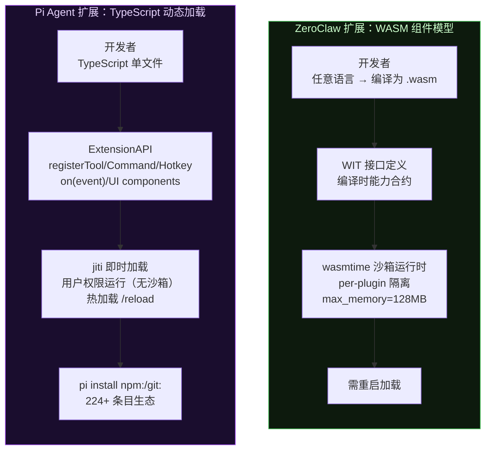

# ZeroClaw vs Pi Agent — 功能逐项对比

> **数据来源**：GitHub 仓库实时数据（2026-08-02）
> - Pi Agent: [earendil-works/pi](https://github.com/earendil-works/pi) — 82k ⭐ | MIT | TypeScript | 创建于 2025-08
> - ZeroClaw: [zeroclaw-labs/zeroclaw](https://github.com/zeroclaw-labs/zeroclaw) — 32.5k ⭐ | Apache 2.0 | Rust | 创建于 2026-02
>
> ✅=内置  ⚠️=扩展/社区/可选  ❌=不支持  🤷=不适用

---

## 定位：同一个品类，不同的 scope

ZeroClaw 和 Pi Agent **不是两个不同的品类**——它们的核心是同一个东西。差别在内核之上的 scope。



**两者共享同一个内核 DNA，差别在于内核之上的 scope。** Pi 把内核做到极致精简，其余全交给扩展生态。ZeroClaw 把内核做到极致完整，把能想到的所有集成全塞进去。

---

## 分层架构对比（并排）



---

## 核心差异视图：同一内核，不同围度



---

## 数据流对比（一次完整对话）

### ZeroClaw

```
                    ┌──────────────────────────────────────────────┐
                    │           🔌 入口 (Channel/WS/CLI/ACP)        │
                    └──────────┬───────────────────────────────────┘
                               │ session_key 入队
                               ▼
                    ┌──────────────────────────────────────┐
                    │  📋 SessionActorQueue                │
                    │  Semaphore(1) per session_key        │
                    │  同 session 串行，不同 session 并行    │
                    └──────────┬───────────────────────────┘
                               │ 获取 slot，构造 Agent
                               ▼
         ┌─────────────────────┴──────────────────────┐
         │          🧠 Agent 构造                      │
         │  from_live_config_with_session_cwd()       │
         │  ├─ resolve model_provider + routing       │
         │  ├─ SecurityPolicy::for_agent()            │
         │  ├─ ScopedToolRegistry::assemble()         │
         │  └─ create_memory_for_agent()              │
         └─────────────────────┬──────────────────────┘
                               │
          ┌────────────────────┴────────────────────┐
          │                                         │
          ▼                                         ▼
   ┌──────────────┐                      ┌──────────────────┐
   │  💾 Memory    │                      │  🔄 ToolLoop      │
   │              │  recall(query,        │                  │
   │  SQLite+向量  │─────session_id)──────▶│  ═══ 最多10轮 ═══ │
   │  FTS5+cosine │                      │  ┌──────────────┐ │
   │  语义检索     │◀─── 注入系统提示词 ────│  │ call_provider│ │
   └──────────────┘                      │  └──────┬───────┘ │
                                         │         │         │
                                         │         ▼         │
                                         │  ┌──────────────┐ │
                                         │  │ 🤖 Provider  │ │
                                         │  │ chat(m,tools)│ │
                                         │  └──────┬───────┘ │
                                         │         │ stream  │
                                         │         ▼         │
                                         │  ┌──────────────┐ │
                                         │  │ parse        │ │
                                         │  │ text/tool?   │ │
                                         │  └──┬───────┬───┘ │
                                         │     │       │     │
                                         │  text│  tool_call │
                                         │     │       │     │
                                         │     ▼       ▼     │
                                         │  ┌─────┐ ┌──────────────┐
                                         │  │输出 │ │🛡️ Security   │
                                         │  │流式 │ │Policy.validate│
                                         │  └─────┘ └──┬───┬───┬───┘
                                         │            │   │   │
                                         │      approved│  │blocked
                                         │            │   │   │
                                         │            ▼   ▼   ▼
                                         │  ┌──────────┐ ┌──────┐
                                         │  │ 🔧 Tools │ │拒绝  │
                                         │  │ execute  │ │执行  │
                                         │  └────┬─────┘ └──────┘
                                         │       │
                                         │       ▼
                                         │  ┌──────────────┐
                                         │  │ append+detect│
                                         │  └──────────────┘
                                         └──────────────────┘
                               │                    │
                               ▼                    ▼
                      ┌──────────────┐   ┌──────────────────┐
                      │ store+       │   │  📤 输出          │
                      │ consolidation│   │  Channel/WS/CLI   │
                      └──────────────┘   └──────────────────┘
```

**关键路径说明：**

| 步骤 | 组件 | 做了什么 |
|------|------|---------|
| 1. 入队 | SessionActorQueue | 同 session_key 串行化，保证上下文一致性 |
| 2. 构造 | Agent 构造器链 | 解析 model/skill/workspace，装配策略和工具 |
| 3. 记忆注入 | Memory.recall() | SQLite 混合搜索召回相关记忆，注入系统提示词 |
| 4. 调模型 | Provider.chat() | 流式返回，支持 fallback |
| 5. 解析 | parse_response | 分流：纯文本直接输出，tool_call 进入审批 |
| 6. 审批 | SecurityPolicy | approved→执行 / requires_approval→弹窗 / blocked→拒绝 |
| 7. 持久化 | Memory.store() | 存储会话 + 触发 consolidation 整理长期记忆 |

### Pi Agent

```
                    ┌───────────────────────────────────────┐
                    │      ⌨️ 用户输入                        │
                    │      "帮我重构这个模块"                   │
                    └──────────┬────────────────────────────┘
                               │
                               ▼
                    ┌───────────────────────────────────────┐
                    │  📝 Editor                             │
                    │  ├─ @ 文件引用 (模糊搜索)               │
                    │  ├─ / 斜杠命令 (25+)                   │
                    │  ├─ !/!! 内联 bash                     │
                    │  ├─ Ctrl+G 外部编辑器                   │
                    │  └─ Tab 路径补全                       │
                    └──────────┬────────────────────────────┘
                               │ 提交 prompt
                               ▼
                    ┌───────────────────────────────────────┐
                    │  🔄 agentLoop                          │
                    │                                       │
                    │  ┌──────────────────────────┐         │
                    │  │ compaction check         │         │
                    │  │ 上下文溢出? → 自动摘要压缩  │         │
                    │  └──────────┬───────────────┘         │
                    │             │                         │
                    │  ┌──────────▼───────────────┐         │
                    │  │ 🤖 LLM Provider          │         │
                    │  │ chat(messages, tools)     │         │
                    │  │ SSE/WS transport 可切换   │         │
                    │  └──────────┬───────────────┘         │
                    │             │ stream                  │
                    │  ┌──────────▼───────────────┐         │
                    │  │ parse → text | tool_call │         │
                    │  └──────┬───────────┬───────┘         │
                    │         │           │                 │
                    │      text      tool_call              │
                    │         │           │                 │
                    │         ▼           ▼                 │
                    │  ┌──────────┐ ┌──────────────────┐   │
                    │  │ 🖥️ TUI  │ │🔌 Extensions     │   │
                    │  │ 流式渲染 │ │ beforeToolCall() │   │
                    │  └──────────┘ │ → continue/block │   │
                    │               └────────┬─────────┘   │
                    │                        │             │
                    │               ┌────────▼─────────┐   │
                    │               │ 🔧 Tools          │   │
                    │               │ read/write/edit/  │   │
                    │               │ bash (4 工具)      │   │
                    │               └────────┬─────────┘   │
                    │                        │             │
                    │               ┌────────▼─────────┐   │
                    │               │ Extensions       │   │
                    │               │ afterToolCall()  │   │
                    │               └──────────────────┘   │
                    └──────────────────┬────────────────────┘
                                       │
                         ┌─────────────┴──────────────┐
                         │                            │
                         ▼                            ▼
              ┌──────────────────┐         ┌──────────────────┐
              │ 🌲 Session        │         │  steering queue  │
              │ JSONL Tree        │         │  Enter = 等工具完成│
              │ ├─ fork 分支      │         │  Alt+Enter=全停后 │
              │ ├─ clone 克隆     │         │  Escape = 恢复    │
              │ └─ tree 导航      │         └──────────────────┘
              └──────────────────┘                  │
                                                    ▼
                                         ┌──────────────────┐
                                         │ 🖥️ TUI 最终渲染   │
                                         │ footer: cwd/session│
                                         │  /token/cost/model│
                                         └──────────────────┘
```

**关键路径说明：**

| 步骤 | 组件 | 做了什么 |
|------|------|---------|
| 1. 输入 | Editor | @文件引用、/斜杠命令、!内联 bash 全部在输入层处理 |
| 2. 压缩检查 | compaction check | 上下文接近窗口上限时自动摘要，也可 `/compact` 手动触发 |
| 3. 调模型 | LLM Provider | 流式返回，SSE/WS transport 可切换，session_id 传递给 provider 做缓存 |
| 4. 工具钩子 | Extensions | beforeToolCall 可拦截/修改/阻止工具调用；afterToolCall 可后处理结果 |
| 5. 执行 | Tools | 仅 4 个：read/write/edit/bash（grep/find/ls 需手动开启） |
| 6. 持久化 | Session JSONL Tree | 树状存储，每行有 id+parentId，支持原地分支无需复制文件 |
| 7. 消息队列 | steering/follow-up | Agent 运行中仍然可以排队新消息，Enter 投递时机不同 |

<details>
<summary>Mermaid 版本（GitHub 可渲染）</summary>

#### ZeroClaw

```mermaid
sequenceDiagram
    participant Entry as 入口(Channel/WS/CLI)
    participant Queue as SessionActorQueue
    participant Agent as Agent构造
    participant Memory as Memory
    participant Loop as ToolLoop
    participant Provider as LLM Provider
    participant Security as SecurityPolicy
    participant Tools as Tools
    participant Output as 输出

    Entry->>Queue: session_key入队
    Queue->>Agent: 获取slot,构造Agent
    Agent->>Memory: recall(query,session_id)
    Memory-->>Agent: 注入系统提示词
    Loop->>Provider: chat(messages,tools)
    Provider-->>Loop: stream
    Loop->>Loop: parse
    alt text
        Loop->>Output: 流式输出
    else tool_call
        Loop->>Security: validate
        alt approved
            Security->>Tools: execute
        else requires_approval
            Security->>Output: 等待审批
            Output-->>Security: allow/deny
        else blocked
            Security-->>Loop: 拒绝
        end
        Tools-->>Loop: result
    end
    Loop->>Loop: append+loop_detect
    Note over Loop: 最多10轮
    Loop->>Memory: store+consolidation
```

#### Pi Agent

```mermaid
sequenceDiagram
    participant User as 用户
    participant Editor as Editor
    participant Loop as agentLoop
    participant Provider as LLM Provider
    participant Ext as Extensions
    participant Tools as Tools
    participant Session as Session Tree
    participant TUI as TUI

    User->>Editor: prompt(@文件,/命令,!bash)
    Editor->>Loop: 提交
    Loop->>Loop: compaction check
    Loop->>Provider: chat
    Provider-->>Loop: stream
    Loop->>Loop: parse
    alt text
        Loop->>TUI: 流式渲染
    else tool_call
        Loop->>Ext: beforeToolCall
        Ext-->>Loop: continue/block
        Loop->>Tools: execute
        Tools-->>Loop: result
        Loop->>Ext: afterToolCall
    end
    Loop->>Session: append JSONL tree
    alt steering
        User->>Loop: Enter排队
    else follow-up
        User->>Loop: Alt+Enter排队
    end
    Loop->>TUI: 最终渲染+footer
```

</details>

---

## 扩展机制对比



| 维度 | ZeroClaw WASM | Pi Agent TS Extensions |
|---|---|---|
| 安全隔离 | ✅ 原生沙箱，per-plugin 隔离 | ❌ 以用户权限运行 |
| 开发体验 | 慢（编译 wasm → 重启） | 快（写 .ts → /reload 即时生效） |
| 能力授权 | WIT 接口编译时合约 | 无内置授权（能力门在 pi_agent_rust 中） |
| 生态规模 | experimental | 成熟（224+ 条目，npm/git 分发） |
| 包管理 | ❌ | ✅ install/remove/update/list |
| 热加载 | ❌ | ✅ 主题热重载 + 扩展热加载 |
| 语言支持 | 任意 → wasm | TypeScript only |

---

## GitHub 仓库概览

| | ZeroClaw | Pi Agent |
|---|---|---|
| **Stars** | 32,481 | 82,049 |
| **Forks** | 4,859 | 10,143 |
| **Open Issues** | 684 | 94 |
| **语言** | Rust (edition 2024) | TypeScript |
| **许可证** | MIT OR Apache 2.0 双许可 | MIT |
| **创建时间** | 2026-02-13 | 2025-08-09 |
| **首次开源** | 比 Pi 晚 ~6 个月 | 早半年 |
| **仓库年龄** | ~6 个月 | ~12 个月 |
| **包管理** | Cargo workspace (22 crates) | npm workspaces (4 packages) |
| **二进制/包名** | `zeroclaw` (cargo install) | `@earendil-works/pi-coding-agent` (npm) |

---

## 一、Agent 核心引擎

| 功能 | ZeroClaw | Pi Agent |
|---|---|---|
| Agent Loop（对话主循环） | ✅ ToolLoop | ✅ agentLoop |
| 多轮工具调用 | ✅ max_tool_iterations=10 | ✅ max_turns |
| 并行工具执行 | ✅ parallel mode | ✅ parallel_tool_execution |
| 顺序工具执行 | ✅ sequential mode | ✅ sequential mode |
| 流式响应 | ✅ SSE + WS streaming | ✅ SSE/WS transport（可切换） |
| 中途取消/abort | ✅ cancel_token | ✅ Escape 键 |
| 旁路消息（steering） | ✅ steering | ✅ Enter=steering, Alt+Enter=follow-up |
| 消息队列模式 | ❌ | ✅ one-at-a-time / all 两种投递模式 |
| 防死循环 | ✅ loop_detector | ⚠️ 依赖 max_turns |
| 会话中模型切换 | ❌ | ✅ `/model` + Ctrl+P/Ctrl+L |
| thinking/reasoning 级别 | ✅ | ✅ `/settings` + Shift+Tab 切换 |
| 模型轮换（scoped models） | ❌ | ✅ Ctrl+P/Shift+Ctrl+P 在启用的模型间轮换 |
| 最大迭代次数限制 | ✅ | ✅ |

---

### Agent Loop 与 ReAct 的关系

**Agent Loop 就是 ReAct 模式的工程实现。**

ReAct（Reasoning + Acting）是 Google DeepMind 2022 年提出的论文范式，定义了 AI Agent 的核心行为模式：

```
ReAct 论文范式                              Agent Loop 工程实现
─────────────                              ────────────────────

  Thought: "我需要知道天气"                    LLM 内部推理（thinking block）
       │                                           │
  Action: call weather_api("北京")             LLM 输出 tool_call
       │                                           │
  Observation: "北京 22°C"                    工具执行返回结果
       │                                           │
  Thought: "22°C不需要提醒"                   LLM 看到结果后继续推理
       │                                           │
  Action: finish("天气22°C")                  LLM 输出纯文本，结束
```

**三者关系：**

```
ReAct（学术范式，2022）
  └─ 定义了 "Thought → Action → Observation → Thought" 循环

Agent Loop（工程模式）
  └─ 是 ReAct 的可运行实现：while not done and iter < max: LLM.chat() → parse → execute → loop

ZeroClaw ToolLoop / Pi agentLoop（具体代码）
  └─ 在 ReAct 基础上嵌入各自的策略和能力
```

**ZeroClaw vs Pi Agent 在 Loop 内嵌了什么：**

```
ReAct 环节        ZeroClaw ToolLoop               Pi agentLoop
─────────         ─────────────────               ──────────────
Thought           LLM 推理                        LLM 推理
      ↓
Action            parse → tool_call               parse → tool_call
      ↓            ├─ memory_inject 注入记忆          ├─ compaction check 压缩检查
                  ├─ approval_gate 审批门            ├─ beforeToolCall 扩展钩子
                  ├─ loop_detector 死循环检测         │   （可拦截/修改/阻止）
                  └─ parallel/sequential 执行        └─ 执行（仅4工具）
      ↓
Observation       tool result → append_history     tool result → afterToolCall 钩子
      ↓
循环控制           max_tool_iterations=10           max_turns 硬上限
终止条件           LLM 不再输出 tool_call            同左
```

**一句话：ReAct 是方法论，Agent Loop 是落地代码。两者的 Agent Loop 核心逻辑一样，差别在 loop 内部嵌入了什么。**

### 用一个具体例子走一遍 Agent Loop

用户输入：**"帮我查一下今天北京天气，然后发邮件给张三告诉他"**

```
┌──────────────────────────────────────────────────────────────┐
│                                                              │
│   ① 🤖 Agent: 把对话历史 + 工具列表 发给 LLM                  │
│          │                                                   │
│          ▼                                                   │
│   ② 🧠 LLM:  "我需要调用 weather 工具"                       │
│          │     （推理：要查天气 → 选 weather 工具 → 填参数）    │
│          ▼                                                   │
│   ③ 🤖 Agent: 执行 weather() → 结果："北京 22°C 晴"           │
│          │     （解析 tool_call → 调工具 → 拿结果）            │
│          ▼                                                   │
│   ④ 🤖 Agent: 把工具结果追加到对话，再发给 LLM                 │
│          │                                                   │
│          ▼                                                   │
│   ⑤ 🧠 LLM:  "调用 send_email 工具"                          │
│          │     （推理：天气拿到了 → 要发邮件 → 填收件人和内容）  │
│          ▼                                                   │
│   ⑥ 🤖 Agent: 执行 send_email(to="张三", body="22°C晴")       │
│          │      → 结果："发送成功"                             │
│          ▼                                                   │
│   ⑦ 🤖 Agent: 把结果再发给 LLM                                │
│          │                                                   │
│          ▼                                                   │
│   ⑧ 🧠 LLM:  "已完成！北京今天22°C晴，已发邮件给张三"           │
│          │     （推理：任务都完成了 → 输出总结文本）            │
│          ▼                                                   │
│   ⑨ 🤖 Agent: 没有更多 tool_call → 结束，输出给用户            │
│              （loop_detect + store + 日志）                   │
│                                                              │
│   ═══ LLM 只做 ②⑤⑧（思考+决策），其余全是 Agent 干的 ═══     │
│                                                              │
└──────────────────────────────────────────────────────────────┘
```

**LLM 只负责三件事：思考、决策、组织语言。Agent 负责剩下的一切。**

```
步骤  谁做      做了什么
────  ────      ──────
 ①   🤖 Agent   拼装请求（历史+工具定义+系统提示词），发给 LLM
 ②   🧠 LLM    推理：用户要查天气 → 选 weather 工具 → 填参数"北京"
 ③   🤖 Agent   解析 LLM 返回的 tool_call，调 weather API，拿结果
 ④   🤖 Agent   把工具结果追加到对话历史，重新拼装请求，发给 LLM
 ⑤   🧠 LLM    推理：天气拿到了 → 下一步发邮件 → 填收件人和内容
 ⑥   🤖 Agent   解析 tool_call，调 send_email API，拿结果
 ⑦   🤖 Agent   把结果追加到对话历史，再发给 LLM
 ⑧   🧠 LLM    推理：两个任务都完成了 → 生成总结文本
 ⑨   🤖 Agent   检测无 tool_call → loop_detect → store → 输出
```

### 再走一个更复杂的例子

用户输入：**"过去一周我省法定传染病报告总数是多少？较前一周上升还是下降，上升或下降多少？"**

可用工具中有 `getcase`：入参为 **地区、开始日期、结束日期、病种（可选）**。

这个例子比"查天气发邮件"复杂——LLM 需要先查出本周数据，发现要做对比，再主动查一次上周数据。

```
┌──────────────────────────────────────────────────────────────┐
│                                                              │
│   ① 🤖 Agent: 把对话历史 + 工具列表（含 getcase）发给 LLM     │
│          │                                                   │
│          ▼                                                   │
│   ② 🧠 LLM:  "用户要过去一周的传染病数据，调用 getcase"        │
│          │     getcase(region="XX省",                         │
│          │             start_date="2026-07-27",               │
│          │             end_date="2026-08-02")                 │
│          │     （推理：地区=我省 → XX省，日期=最近7天，        │
│          │      病种不填=查全部）                              │
│          ▼                                                   │
│   ③ 🤖 Agent: 执行 getcase()                                 │
│          │     → 返回：本周报告总数 1,250 例                   │
│          ▼                                                   │
│   ④ 🤖 Agent: 把结果追加到对话，再发给 LLM                    │
│          │                                                   │
│          ▼                                                   │
│   ⑤ 🧠 LLM:  "拿到了本周 1,250 例。                           │
│               但用户要跟上周对比，我还需要上周的数据"           │
│          │     getcase(region="XX省",                         │
│          │             start_date="2026-07-20",               │
│          │             end_date="2026-07-26")                 │
│          │     （推理：数据不够 → 主动追加查询，               │
│          │      日期往前推 7 天）                              │
│          ▼                                                   │
│   ⑥ 🤖 Agent: 执行 getcase()                                 │
│          │     → 返回：上周报告总数 1,100 例                   │
│          ▼                                                   │
│   ⑦ 🤖 Agent: 把上周数据追加到对话，再发给 LLM                │
│          │                                                   │
│          ▼                                                   │
│   ⑧ 🧠 LLM:  "两期数据齐了。                                  │
│               本周 1,250 例，上周 1,100 例。                   │
│               上升了 150 例，环比上升 13.6%。"                  │
│          │     （推理：数据完整 → 做算术 → 组织答案）           │
│          ▼                                                   │
│   ⑨ 🤖 Agent: 没有更多 tool_call → 结束                      │
│                                                              │
│   ═══ 4 个回合，2 次 getcase 调用，LLM 自主补全了对比查询 ═══  │
│                                                              │
└──────────────────────────────────────────────────────────────┘
```

**对比上两个例子：**

| | 天气+邮件 | 传染病报告 (getcase) |
|---|---|---|
| **工具调用** | 2 个不同工具（weather, send_email） | 同一工具调 2 次（getcase × 2） |
| **LLM 决策模式** | 一步到位，提前规划好全部路线 | 边看边决定，拿到结果才发现需要再查 |
| **数据依赖** | 无（参数都已知） | 有（第一次结果决定是否需要第二次） |
| **LLM 做的事** | 规划 route → 执行 | 调工具 → 看到数据 → 发现不够 → **主动补参数再调** → 计算 → 总结 |
| **Agent 做的事** | 执行 2 个工具 | 执行 2 次同一个工具，每轮拼装越来越长的历史 |
| **关键能力** | 任务规划 | **自主发现信息缺口 + 补全查询 + 数值推理** |

**核心启示：Agent Loop 的能力边界不在循环本身，在 LLM 的推理能力。** 步骤⑤是决定性时刻——LLM 自己意识到"数据不够，需要再查一次"，然后自己算出了前一周的日期范围。循环只是给了它反复行动的机会，能不能抓住这个机会取决于模型水平。这就是为什么同一个 Agent Loop，配不同模型表现天差地别。

**用这个例子看 ZeroClaw 和 Pi Agent 的差异：**

```
步骤              ZeroClaw 会额外做              Pi Agent 会额外做
────              ──────────────                ──────────────
① 发 LLM          memory.recall("传染病 报告")   compaction check
                  从长期记忆召回过往相关对话

③ 执行 getcase    SecurityPolicy.validate       beforeToolCall 钩子
                  → approved（只读查询）          扩展可以决定要不要放行
                  无审批，直接执行

⑤ LLM 自主补查     LLM 推理由 Agent Loop          同上，loop 继续运转
                  的循环机制承载                  不限制 LLM 调几次工具
                  "再调一次工具？当然可以"

⑥ 再执行 getcase  loop_detector 检查：           steering queue：
                  "同一个工具，参数不同            用户中途有没有排队
                  日期范围变了，不是兜圈子 ✓"      新消息？

⑨ 结束            memory.store()                 JSONL Tree 写入
                  把"关注XX省传染病数据"           支持以后 fork 回溯
                  记入长期记忆                    到这次对比查询
```

```
步骤         ZeroClaw                              Pi Agent
────         ────────                              ────────
① 发 LLM     ├─ memory.recall("天气 邮件")         ├─ compaction check（溢出？）
              │  从向量库召回相关记忆注入            │  自动摘要压缩旧消息
              └─ 注入系统提示词                      └─ AGENTS.md 级联加载

② LLM 返回   parse → 识别为 tool_call               parse → 识别为 tool_call

③ 执行工具   ├─ SecurityPolicy.validate(weather)    ├─ beforeToolCall 钩子
              │   → approved（读操作，直接放行）       │   扩展可拦截/修改/阻止
              └─ 执行                                └─ 执行

④ 追加发LLM  append_history                        afterToolCall 钩子 → append

⑤ LLM 返回   parse → 识别为 tool_call               同左

⑥ 执行工具   ├─ SecurityPolicy.validate(send_email)   beforeToolCall → 执行
              │   → requires_approval
              │   → ⚠️ 弹窗等用户点"允许"              （无审批门，直接执行）
              └─ 执行

⑦ 再发 LLM   append_history                        afterToolCall → append

⑧ LLM 返回   parse → 纯文本，流式输出                 parse → 纯文本，流式渲染

⑨ 结束       ├─ loop_detector: 没兜圈子 ✓            ├─ steering queue: 有新消息?
              ├─ memory.store() 存入长期记忆           └─ 写入 JSONL Tree
              └─ 日志 JSONL
```

---

### 再走一个：跨年度对比排名

用户输入：**"本年度法定传染病报告病例数排名前十的病种是哪些？与过去三年同期相比，哪些病种占比显著上升或下降？"**

可用工具仍然是 `getcase(region, start_date, end_date, disease?)`。

这个例子比前两个更进一步——不是 2 次工具调用，而是需要多年度数据、排序、占比计算、跨年对比。

```
┌──────────────────────────────────────────────────────────────┐
│                                                              │
│   ① 🤖 Agent: 把对话历史 + 工具列表 发给 LLM                  │
│          │                                                   │
│          ▼                                                   │
│   ② 🧠 LLM:  "用户要本年度排名 + 三年同期对比。               │
│               先拉今年的全量数据"                              │
│          │     getcase(region="XX省",                         │
│          │             start_date="2026-01-01",               │
│          │             end_date="2026-08-02")                 │
│          │     （推理：本年度 = 2026，病种不填 = 全病种）      │
│          ▼                                                   │
│   ③ 🤖 Agent: 执行 getcase()                                 │
│          │     → 返回：2026年各病种数据（含病例数）            │
│          ▼                                                   │
│   ④ 🤖 Agent: 把结果追加到对话，再发给 LLM                    │
│          │                                                   │
│          ▼                                                   │
│   ⑤ 🧠 LLM:  "2026年数据拿到了。                              │
│               现在需要拉过去三年同期（1-8月）做对比。           │
│               三年数据，同一个时期范围，可以一次全列出来"       │
│          │     getcase(region="XX省",                         │
│          │             start_date="2025-01-01",               │
│          │             end_date="2025-08-02")                 │
│          │     （推理：2023/2024/2025，每年一次，共三次）       │
│          ▼                                                   │
│   ⑥ 🤖 Agent: 执行 getcase(2025) → 返回 2025 年数据           │
│          │                                                   │
│          ▼                                                   │
│   ⑦ 🤖 Agent: 追加结果，再发 LLM                              │
│          │                                                   │
│          ▼                                                   │
│   ⑧ 🧠 LLM:  "还差两年"                                      │
│          │     getcase(start="2024-01-01", end="2024-08-02") │
│          ▼                                                   │
│   ⑨ 🤖 Agent: 执行 getcase(2024) → 返回 2024 年数据           │
│          │                                                   │
│          ▼                                                   │
│   ⑩ 🤖 Agent: 追加结果，再发 LLM                              │
│          │                                                   │
│          ▼                                                   │
│   ⑪ 🧠 LLM:  "最后一年"                                      │
│          │     getcase(start="2023-01-01", end="2023-08-02") │
│          ▼                                                   │
│   ⑫ 🤖 Agent: 执行 getcase(2023) → 返回 2023 年数据           │
│          │                                                   │
│          ▼                                                   │
│   ⑬ 🤖 Agent: 把四年数据全部追加，再发 LLM                    │
│          │                                                   │
│          ▼                                                   │
│   ⑭ 🧠 LLM:  "四年数据（2023-2026 同期）都齐了。              │
│                                                              │
│               🔢 排名（2026年）：                               │
│               1. 手足口病  12,500 例 (31.2%)                  │
│               2. 流感       8,200 例 (20.5%)                  │
│               3. 其它感染性腹泻 5,600 例 (14.0%)              │
│               ...（共排出前十）                                │
│                                                              │
│               📊 与三年同期对比：                              │
│               - 手足口病：占比从 2023 年 22.1% → 2026 年      │
│                 31.2%，↑ 9.1 个百分点，显著上升                │
│               - 流感：占比从 2023 年 28.5% → 2026 年          │
│                 20.5%，↓ 8.0 个百分点，显著下降                │
│               - 其它感染性腹泻：基本持平                       │
│               ..."                                           │
│          │     （推理：四年数据 → 排名 → 算占比 → 跨年对比     │
│          │      → 标记显著变化 → 组织完整报告）                │
│          ▼                                                   │
│   ⑮ 🤖 Agent: 没有更多 tool_call → 结束                      │
│                                                              │
│   ═ 7 个回合，4 次 getcase 调用，LLM 做了排名+占比+趋势分析 ═  │
│                                                              │
└──────────────────────────────────────────────────────────────┘
```

**三个例子对照：**

```
例子              工具调用          次数    LLM 核心能力
────              ──────           ──     ────────────
天气+邮件         两个不同工具      2 次    任务规划（提前画好路线）
                  weather→email

传染病周报         同一工具不同参数  2 次    自主补全（发现信息缺口，
                  getcase × 2             主动追加查询）

跨年度对比         同一工具四年数据  4 次    批量数据获取 + 排序 +
                  getcase × 4             占比计算 + 趋势判定 + 报告生成
```

**三个例子串起来看 Agent Loop 的本质：**

```
Agent Loop 做的事，从头到尾只有一件事：

    "把 LLM 要的工具调了，把结果塞回去，让它再想"

    ┌──────────┐     ┌──────────┐     ┌──────────┐
    │ LLM 决定  │ ──→ │ Agent 执行│ ──→ │ LLM 再想 │ ──→ ...
    └──────────┘     └──────────┘     └──────────┘

复杂度的来源不在循环本身，在 LLM 每次"想"的质量：

    简单场景：LLM 想一次就知道全部路线
    中等场景：LLM 边看结果边修正路线
    复杂场景：LLM 需要拉大量数据、做计算、做判断、组织报告
```

**这个例子中 ZeroClaw 和 Pi Agent 的差异：**

```
差异点                 ZeroClaw                        Pi Agent
──────                 ──────────                      ────────
④→⑤→⑦→⑩→⑬ 之间       loop_detector 每轮检查：         steering queue：
LLM 连续调了 4 次       "同一工具 getcase 连续调了       用户可以在任何时候
getcase                N 次，但年份参数每次都不同，      排队新消息
                       不是兜圈子 ✓"

⑭ LLM 做大量计算       Agent 的角色到此为止：           同左
和推理时               LLM 自己在推理中完成了            循环机制不干预 LLM
                       排序、占比计算、趋势判定           的内容生成
                       Agent 只是"递数据的人"

⑮ 结束                 memory.store()                   JSONL Tree 写入
                       把"用户关注传染病趋势"             整段 7 回合对话可
                       和排名结果记入长期记忆             完整回溯、fork
```

---

### LLM 的理解能力才是 Agent 系统的核心

三个例子看下来，有一个结论越来越清楚：**Agent Loop 决定了"能不能动"，LLM 决定了"有多聪明"。**

```
🤖 Agent Loop（身体）                  🧠 LLM（大脑）
─────────────────                    ─────────────
能做：                                能做：
  ✅ 执行工具                            ✅ 理解用户到底想干什么
  ✅ 拼装请求发给 LLM                     ✅ 决定调哪个工具、填什么参数
  ✅ 把结果追加回对话历史                  ✅ 判断拿到结果后够不够
  ✅ 检测死循环                           ✅ 自己发现信息缺口
  ✅ 审批门                              ✅ 做排序、计算、占比、对比
  ✅ 存储记忆                            ✅ 判断变化是"显著"还是"轻微"
                                         ✅ 组织最终答案给用户

绝不能做：                              绝不能做：
  ❌ 理解用户说什么                       ❌ 真正执行工具（只能输出 tool_call）
  ❌ 决定下一步调什么                      ❌ 记住上一轮说了什么（靠 Agent 把历史塞回来）
  ❌ 判断结果够不够                        ❌ 知道自己是不是在兜圈子
```

**回头看三个例子，循环逻辑一模一样，复杂度的差异全在 LLM：**

```
天气+邮件：
  LLM 理解："查天气发邮件"是两个独立任务，顺序不能反（天气结果是邮件内容）
  如果理解错了 → 可能先发空邮件再查天气
  理解门槛：★★☆

传染病周报：
  LLM 理解："较前一周"意味着需要两个数据点对比 → 本周不够 → 自己算上周日期
  如果理解错了 → 拿到本周数据就停，用户追问才补
  理解门槛：★★★☆

跨年度对比排名：
  LLM 理解："排名前十"+"三年同期"+"占比上升或下降"+"显著" → 四年数据 → 算占比 → 排序 → 趋势 → 判定显著性
  如果理解错了 → 拉今年数据排个名就交差
  理解门槛：★★★★★
```

**这意味着什么：**

| | Agent Loop 代码 | LLM | 效果 |
|---|---|---|---|
| 接 GPT-3.5 | 一模一样 | 理解有限 | 简单任务 OK，复杂任务丢步骤 |
| 接 Claude Sonnet | 一模一样 | 理解中上 | 自主补全大部分信息缺口 |
| 接 Claude Opus | 一模一样 | 理解极强 | 四年数据一口气拉完，附带趋势分析建议 |
| 接开源 7B 模型 | 一模一样 | 理解弱 | 可能不知道自己要调什么工具 |

**循环代码一行都没变，变的是 LLM。** Agent Loop 只是给了 LLM "反复想、反复做"的机制，但"想得多深"、"做得多准"，全在 LLM 的理解和推理水平。

---

## 二、工具系统

### 内置工具

| 工具 | ZeroClaw | Pi Agent |
|---|---|---|
| shell/bash 执行 | ✅ `shell` | ✅ `bash` |
| 读文件 | ✅ `file_read` | ✅ `read` |
| 写文件 | ✅ `file_write` | ✅ `write` |
| 精确编辑（字符串替换） | ❌ | ✅ `edit` |
| grep/ripgrep | ❌ | ⚠️ 可选（opt-in） |
| find/fd | ❌ | ⚠️ 可选（opt-in） |
| ls | ❌ | ⚠️ 可选（opt-in） |
| 浏览器自动化 | ✅ `browser`/`browser_open` (Brave) | ❌ |
| HTTP 请求 | ✅ `http` | ❌ |
| MCP 客户端 | ✅ stdio/HTTP/SSE | ❌ 哲学上拒绝 MCP（可扩展实现） |
| Python 技能 | ✅ `python` | ❌ |
| Web 搜索 | ✅ `web_search` (Tavily/DuckDuckGo/Brave) | ❌ |
| Web 抓取 | ✅ `web_fetch` | ❌ |
| Git | ✅ `git` | ❌ |
| 记忆操作 | ✅ `memory_store/recall/forget` | ❌ |
| cron 管理 | ✅ `cron` | ❌ |
| SOP 工作流触发 | ✅ `sop` | ❌ |
| Composio（1000+ OAuth） | ⚠️ 可选 | ❌ |
| 语音 TTS/STT | ✅ | ❌ |
| 硬件 GPIO/I2C/SPI/USB | ✅ | ❌ |
| 工具数量 | 10+ 内置 | 4 内置 + 3 可选 |

### 工具基础设施

| 功能 | ZeroClaw | Pi Agent |
|---|---|---|
| JSON Schema 参数定义 | ✅ serde_json | ✅ TypeBox |
| 工具输出截断 | ❌ | ✅ 2000行/50KB 自动截断 |
| 工具执行超时 | ✅ `tool_timeout_secs` | ❌ |
| 危险工具标记 | ✅ `dangerous()` + `risk_level()` | ❌ |
| 工具审批门（approval gate） | ✅ 内置 allow/deny/always_allow | ❌（需扩展实现） |
| HMAC 工具回执 | ✅ | ❌ |
| 终止标记 | ✅ | ✅ `terminate: true` |
| 流式进度 | ✅ `ToolOutput::Stream` | ✅ `onUpdate` |
| 运行时动态注册工具 | ❌ | ✅ `pi.registerTool()` |
| 工具覆盖/包装 | ⚠️ ScopedToolRegistry 装配时 | ✅ `tool-override` 扩展 |
| Bash 后端的可替换性 | ⚠️ Docker sandbox | ✅ Gondolin/Docker/OpenShell 后端 |

---

## 三、安全模型

| 功能 | ZeroClaw | Pi Agent |
|---|---|---|
| **自主级别** | ✅ 4 级（Full/Supervised/Restricted/Block） | ❌ |
| **命令白名单** | ✅ `allowed_commands` per risk_profile | ❌ |
| **禁止路径** | ✅ `forbidden_paths` | ❌（可扩展实现） |
| **工具白名单/黑名单** | ✅ `allowed_tools`/`excluded_tools` | ❌ |
| **per-tool 自主覆盖** | ✅ file_ops/shell/web/browser 各自可配 | ❌ |
| **Workspace 隔离** | ✅ `workspace_only=true` | ❌ |
| **路径逃逸检测** | ✅ symlink 检测 + null-byte 阻断 | ❌ |
| **敏感文件保护** | ✅ 14 系统目录 + 4 敏感 dotfile 自动屏蔽 | ❌ |
| **沙箱后端** | ✅ landlock/bubblewrap/seatbelt/docker/firejail | ⚠️ Gondolin 扩展 / Docker / OpenShell（外部） |
| **设备配对认证** | ✅ 6 位配对码 + Bearer token | ❌ |
| **密钥加密** | ✅ ChaCha20-Poly1305 | ❌ |
| **速率限制** | ✅ `max_requests_per_minute` + `max_actions_per_hour` | ❌ |
| **成本上限** | ✅ `max_cost_per_day_cents` | ❌ |
| **请求体大小限制** | ✅ 默认 10MB | ❌ |
| **公网绑定保护** | ✅ 默认 127.0.0.1，需显式 allow_public_bind | ❌ |
| **紧急停止** | ✅ emergency_stop | ❌ |
| **CORS** | ✅ | ❌ |
| **Project Trust 机制** | ❌ | ✅ ask/always/never + trust.json |
| **扩展安全隔离** | ✅ WASM wasmtime 沙箱 | ❌ 扩展以用户权限运行 |
| **供应链安全** | ⚠️ Cargo.lock | ✅ pinned deps + shrinkwrap + lockfile 变更审查 + npm audit CI |
| **已知 CVE** | 无 | 1 个已修复（CVE-2026-54325） |

### 安全哲学差异

| | ZeroClaw | Pi Agent |
|---|---|---|
| **思路** | "安全是框架的责任" — 纵深防御内置 | "安全是你的责任" — 放进容器或用扩展实现 |
| **默认安全态** | 127.0.0.1 绑定、配对认证、supervised 自主 | 用户权限运行，无内置权限系统 |
| **权限弹窗** | 审批门 allow/deny/always_allow | "没有权限弹窗。放进容器，或用扩展自己建。" |
| **适用场景** | 不可信用户 / 多 Agent / 生产环境 | 个人开发者 / 受控环境 |

---

## 四、记忆系统

| 功能 | ZeroClaw | Pi Agent |
|---|---|---|
| 会话历史 | ✅ session-scoped | ✅ JSONL 对话历史 |
| 长期记忆 | ✅ Core/Daily 持久记忆（consolidation） | ❌ |
| 向量检索 | ✅ SQLite 内建向量 + cosine similarity | ❌ |
| 混合搜索 | ✅ FTS5 关键词 + 向量加权混合 | ❌ |
| 嵌入缓存 | ✅ | ❌ |
| 记忆整理（自动） | ✅ consolidation | ❌ |
| 记忆重索引 | ✅ `zeroclaw memory reindex` CLI | ❌ |
| 可插拔记忆后端 | ✅ SQLite / Markdown / Lucid / None | ❌ |
| 外部向量 DB | ⚠️ Qdrant/pgvector 可选 | ❌ |
| Agent 级记忆隔离 | ✅ AgentScopedMemory | ✅ session_id JSONL 文件隔离 |
| 上下文压缩 | ⚠️ history truncation | ✅ auto-compaction + 摘要 + 自定义指令 |
| 自定义压缩策略 | ❌ | ✅ custom-compaction 扩展 |
| 关系记忆 | ❌ | ❌ |

---

## 五、会话管理

| 功能 | ZeroClaw | Pi Agent |
|---|---|---|
| 会话持久化 | ✅ SQLite | ✅ JSONL（支持 SQLite 索引加速） |
| 自动保存 | ✅ | ✅ |
| 会话恢复 | ✅ | ✅ `pi -r` + `/resume` |
| 会话接续 | ✅ | ✅ `pi -c` |
| **会话命名** | ❌ | ✅ `/name <name>` |
| **会话树（分支导航）** | ❌ | ✅ `/tree`（搜索/折叠/跳转/标签） |
| **会话 fork** | ❌ | ✅ `/fork` + `--fork` CLI |
| **会话 clone** | ❌ | ✅ `/clone` |
| **会话导出** | ❌ | ✅ `/export`（HTML/JSONL） |
| **会话导入** | ❌ | ✅ `/import` |
| **会话分享（GitHub Gist）** | ❌ | ✅ `/share` |
| **会话分享（Hugging Face）** | ❌ | ✅ pi-share-hf |
| 会话并发（多 session 同时运行） | ✅ SessionActorQueue per-key | ❌ 单进程单会话 |
| 会话队列 | ✅ Semaphore(1) per session_key | ❌ |
| 会话超时 | ✅ idle_ttl (600s) | ❌ |
| 临时会话模式 | ❌ | ✅ `--no-session` |
| 会话分支标签/书签 | ❌ | ✅ Shift+L 书签标记 |

---

## 六、消息平台/频道集成

> Pi Agent 是纯 CLI 工具，没有频道概念（另有独立仓库 [earendil-works/pi-chat](https://github.com/earendil-works/pi-chat) 做 Slack 自动化）

| 平台 | ZeroClaw | Pi Agent |
|---|---|---|
| Discord | ✅ | ❌ |
| Telegram | ✅ | ❌ |
| Slack | ✅ | ❌ |
| Signal | ✅ | ❌ |
| Matrix | ✅ | ❌ |
| WhatsApp | ✅ | ❌ |
| LINE | ✅ | ❌ |
| Mattermost | ✅ | ❌ |
| Nextcloud Talk | ✅ | ❌ |
| iMessage | ✅ (macOS) | ❌ |
| IRC | ✅ | ❌ |
| WeCom（企业微信） | ✅ | ❌ |
| DingTalk（钉钉） | ✅ | ❌ |
| Lark/Feishu（飞书） | ✅ | ❌ |
| QQ | ✅ | ❌ |
| Mochat | ✅ | ❌ |
| Notion | ✅ | ❌ |
| 邮件 (IMAP/SMTP) | ✅ | ❌ |
| Gmail Push (Google Pub/Sub) | ✅ | ❌ |
| Jira | ✅ | ❌ |
| Bluesky (AT Protocol) | ✅ | ❌ |
| Nostr | ✅ | ❌ |
| Twitter/X | ✅ | ❌ |
| Reddit | ✅ | ❌ |
| MQTT | ✅ | ❌ |
| AMQP | ✅ | ❌ |
| Webhook (HTTP POST) | ✅ | ❌ |
| SIP 语音电话 | ✅ Telnyx/Twilio/Plivo | ❌ |
| Twitch | ✅ | ❌ |
| 频道总数 | **30+** | **0**（CLI only） |

---

## 七、语音能力

| 功能 | ZeroClaw | Pi Agent |
|---|---|---|
| TTS（文字转语音） | ✅ Piper/OpenAI/ElevenLabs/Google/Azure | ❌ |
| STT（语音转文字） | ✅ Whisper/OpenAI/Deepgram/Google/Azure | ❌ |
| 本地离线 TTS (Piper) | ✅ 免费 | ❌ |
| Wake Word 唤醒 | ✅ Porcupine/OpenWakeWord | ❌ |
| 全双工语音 (barge-in) | ✅ ClawdTalk | ❌ |
| SIP 运营商 | ✅ Telnyx/Twilio/Plivo | ❌ |
| 电话呼入/呼出 | ✅ | ❌ |
| 地区号码供应 | ✅ | ❌ |

---

## 八、提供者/模型

| 功能 | ZeroClaw | Pi Agent |
|---|---|---|
| Anthropic | ✅ | ✅ **+ Claude Pro/Max 订阅** |
| OpenAI | ✅ | ✅ **+ ChatGPT Plus/Pro (Codex) 订阅** |
| Google Gemini | ✅ | ✅ |
| Google Vertex | ✅ | ✅ |
| AWS Bedrock | ✅ | ✅ |
| Azure OpenAI | ✅ | ✅ |
| Ollama | ✅ | ✅ |
| Groq | ✅ | ✅ |
| Mistral | ✅ | ✅ |
| xAI | ✅ | ✅ |
| DeepSeek | ✅ | ✅ |
| OpenRouter | ✅ | ✅ |
| Cerebras | ❌ | ✅ |
| Together AI | ✅ | ✅ |
| Fireworks | ✅ | ✅ |
| NVIDIA NIM | ❌ | ✅ |
| Cloudflare AI Gateway | ❌ | ✅ |
| Cloudflare Workers AI | ❌ | ✅ |
| Vercel AI Gateway | ❌ | ✅ |
| Ant Ling | ❌ | ✅ |
| Kimi For Coding | ❌ | ✅ |
| MiniMax | ❌ | ✅ |
| Xiaomi MiMo | ❌ | ✅ |
| OpenCode Zen/Go | ❌ | ✅ |
| Hugging Face | ❌ | ✅ |
| ZAI Coding Plan | ❌ | ✅ |
| GitHub Copilot 订阅 | ❌ | ✅ |
| Perplexity | ✅ | ❌ |
| Cohere | ✅ | ❌ |
| Moonshot/GLM/Qwen | ✅ | ❌ |
| vLLM/SGLang | ✅ | ✅ |
| llama.cpp 内建路由 | ❌ | ✅ `pi update --models` + `/llama` 管理 |
| LM Studio | ❌ | ✅ |
| 自定义 OpenAI-compatible | ✅ | ✅ + 可通过 `models.json` 注册 + 扩展 |
| 提供者总数 | **23+** | **30+** |
| **订阅式认证** | ❌（仅 API key / 本地） | ✅ 4种（Claude Pro/Max, ChatGPT Plus/Pro, GitHub Copilot, OpenAI Codex） |
| **模型路由/fallback** | ✅ hint-based routing + fallback providers | ❌ 手动切换 |
| **会话中模型切换** | ❌ | ✅ Ctrl+L / `/model` |
| **模型轮换** | ❌ | ✅ Ctrl+P / Shift+Ctrl+P |
| **per-provider 定价** | ✅ | ✅ |
| **成本追踪** | ✅ per-turn 记录 | ✅ per-session 统计（↑↓RWCH 展示） |
| **provider 缓存利用** | ❌ | ✅ session_id 传递给 provider |
| **模型目录自动刷新** | ❌ | ✅ `pi update --models` |

---

## 九、协议与 API

| 功能 | ZeroClaw | Pi Agent |
|---|---|---|
| HTTP REST API | ✅ Gateway ~105 端点 | ❌ |
| WebSocket Gateway | ✅ `zeroclaw.v1` sub-protocol | ❌ |
| ACP (IDE/编辑器协议) | ✅ JSON-RPC 2.0 over stdio/WS + session/cancel | ✅ JSON-RPC 2.0 over stdio |
| A2A (Agent-to-Agent) | ✅ JSON-RPC 2.0 over HTTP | ❌ |
| MCP Client | ✅ stdio/HTTP/SSE 内置 | ❌ 哲学上拒绝（可扩展实现） |
| SSE (事件流) | ✅ | ❌ |
| Webhook 接收 | ✅ POST /webhook + `/whatsapp` + `/slack/events` | ❌ |
| OpenAPI 3.1 规范 | ✅ 自动生成 TS 客户端 | ❌ |
| Scalar API 文档浏览器 | ✅ `/api/docs` | ❌ |
| RPC/TUI 通信 | ✅ JSON-RPC over Unix Domain Socket | ✅ `--mode rpc` (JSONL over stdio) |
| TUI（终端界面） | ✅ zerocode（独立应用） | ✅ pi-tui（内置） |
| **Print 模式（一次性执行）** | ❌ | ✅ `pi -p "prompt"` |
| **JSON 事件流模式** | ❌ | ✅ `--mode json` |
| **SDK 嵌入** | ❌ | ✅ `createAgentSession()` + `createAgentSessionRuntime()` |

---

## 十、自动化与工作流

| 功能 | ZeroClaw | Pi Agent |
|---|---|---|
| Cron 定时任务 | ✅ 内置 cron 引擎 | ❌ |
| SOP 工作流引擎 | ✅ 有向图 + fan-in 触发器 | ❌ |
| Fan-in 源 | ✅ Git / MQTT / AMQP / Calendar / Manual / Channel / Filesystem | ❌ |
| SOP 审批门 | ✅ | ❌ |
| SOP 可恢复运行 | ✅ | ❌ |
| 子 Agent（内置） | ✅ A2A 协议 | ❌（哲学上拒绝，可用扩展） |
| Plan Mode（内置） | ❌ | ❌（需 `/setup` 安装或扩展实现） |
| Git checkpoint/auto-commit | ❌ | ⚠️ 扩展可实现 |
| SSH 远程执行 | ❌ | ⚠️ 扩展可实现 |

---

## 十一、部署与运维

| 功能 | ZeroClaw | Pi Agent |
|---|---|---|
| **安装方式** | curl pipe bash / 源码编译 / cargo install | npm install -g / curl pipe sh |
| **Daemon 模式** | ✅ systemd/launchctl/Windows Service/OpenRC | ❌ |
| **Gateway 长期服务** | ✅ HTTP/WS | ❌ |
| **systemd 集成** | ✅ `zeroclaw service install/start/stop/status/uninstall` | ❌ |
| **首次运行 onboarding** | ✅ Web `/onboard` 向导 + CLI quickstart | ✅ `/login` + `/setup` |
| **配置格式** | TOML (`~/.zeroclaw/config.toml`) | JSON + `/settings` TUI |
| **配置热加载/漂移检测** | ✅ SHA-256 漂移检测 + 409 冲突保护 | ❌ |
| **配置 CRUD API** | ✅ per-property REST + CLI | ✅ `/settings` + `pi config` |
| **配置注释保留** | ✅ comment-preserving PATCH | ❌ |
| **环境变量覆盖** | ✅ `ZEROCLAW_*` | ✅ `PI_*` 系列 |
| **离线模式** | ❌ | ✅ `--offline` / `PI_OFFLINE=1` |
| **健康检查端点** | ✅ `/health` | ❌ |
| **平台支持** | macOS / Linux / Windows / FreeBSD / NixOS | macOS / Linux / Windows / Termux(Android) |
| **架构支持** | ✅ ARM / x86 / RISC-V | x86 / ARM |
| **MUSL 静态编译** | ✅ | ❌ |
| **Docker 容器** | ✅ | ✅ |
| **隧道（Tunnel）** | ✅ Cloudflare/Tailscale/ngrok/Custom | ❌ |
| **二进制大小** | ~3.4MB (release) | ~21MB (Rust 移植) / N/A (TS) |
| **冷启动** | <10ms | <100ms (Rust) / 500ms+ (TS) |
| **内存占用** | <5MB RAM (lean build) | <50MB (Rust) / 200MB+ (TS) |
| **$10 硬件可运行** | ✅ | ❌ |
| **自动更新检查** | ❌ | ✅ pi.dev 版本检查 |
| **遥测** | ❌ | ✅ 安装/更新匿名 ping（可关闭） |

---

## 十二、可观测性

| 功能 | ZeroClaw | Pi Agent |
|---|---|---|
| 结构化日志 | ✅ JSONL schema | ❌ |
| SSE 实时事件广播 | ✅ | ❌ |
| Web Dashboard | ✅ React（聊天/记忆/配置/cron/工具） | ❌ |
| Dashboard 实时模型切换 | ✅ 不丢上下文 | ❌ |
| Dashboard 运行指示器 | ✅ | ❌ |
| Dashboard Stop 按钮 | ✅ | ❌ |
| Dashboard 手动 cron 触发 | ✅ | ❌ |
| Dashboard OpenRouter 免费模型标记 | ✅ | ❌ |
| 日志 API | ✅ `/api/logs` | ❌ |
| 观测器 trait | ✅ Noop/Log/Multi (→Prometheus/OTel 可扩展) | ❌ |
| API 文档浏览器 | ✅ Scalar `/api/docs` | ❌ |
| 成本统计 | ✅ per-turn | ✅ per-session（↑↓RWCH） |
| 会话 Token 统计 | ❌ | ✅ `/session`（ID/messages/tokens/cost） |
| Footer 实时状态栏 | ❌ | ✅ cwd+session+token+model+cost |
| 版本更新日志 | ❌ | ✅ `/changelog` |

---

## 十三、扩展/插件/自定义

| 功能 | ZeroClaw | Pi Agent |
|---|---|---|
| **扩展方式** | WASM 组件模型 (wasmtime + WIT) | TypeScript 扩展 (jiti 动态加载) |
| **沙箱隔离** | ✅ wasmtime 原生沙箱 | ❌ 以用户权限运行 |
| **能力授权** | ✅ WIT 接口编译时合约 | ❌ 无内置权限限制 |
| **热加载** | ❌ 需重启 | ✅ `/reload` 即时 + 主题热重载 |
| **自定义工具** | ✅ Tool trait 编译时 | ✅ `pi.registerTool()` 运行时 |
| **工具覆盖/替换** | ⚠️ ScopedToolRegistry 装配时 | ✅ 扩展可完全替换内置工具 |
| **自定义 slash 命令** | ❌ | ✅ `pi.registerCommand()` |
| **自定义键盘快捷键** | ❌ | ✅ `~/.pi/agent/keybindings.json` |
| **自动补全** | ❌ | ✅ `@` 文件引用 + 扩展可自定义 |
| **自定义主题** | ❌ | ✅ dark/light + 自定义（热重载） |
| **UI 组件扩展** | ❌ | ✅ status line/header/footer/overlay/editor |
| **自定义 provider** | ✅ Provider trait | ✅ 扩展或 `models.json` |
| **prompt 模板** | ❌ | ✅ `/templatename` (Markdown + {{变量}}) |
| **技能系统** | ✅ TOML manifest skill loader | ✅ Agent Skills 标准 + `/skill:name` |
| **Pi Packages（包管理）** | ❌ | ✅ `pi install/remove/update/list/config` |
| **包来源** | ❌ | ✅ npm / git / HTTPS / SSH |
| **项目级 vs 用户级包** | ❌ | ✅ `-l` 本地安装 |
| **级联上下文文件** | ❌ | ✅ AGENTS.md/CLAUDE.md（全局→父目录→当前） |
| **SYSTEM.md 替换/追加** | ❌ | ✅ `.pi/SYSTEM.md` + `APPEND_SYSTEM.md` |
| **Personality 编辑器** | ✅ CLI/TUI/Web 三界面（7 个 markdown 文件） | ❌ |
| **扩展生态规模** | 少数（experimental） | 成熟（npm 关键词 `pi-package` + Discord 社区） |
| **示例扩展** | ❌ | ✅ custom-provider/gondolin/plan-mode/sandbox/subagent/doom-overlay |

---

## 十四、UI/UX（交互体验）

| 功能 | ZeroClaw | Pi Agent |
|---|---|---|
| TUI 终端界面 | ✅ zerocode（独立 TUI 应用） | ✅ pi-tui（内置，差异化渲染） |
| Web Dashboard | ✅ React 全功能 | ❌ |
| IDE/编辑器集成 | ✅ ACP | ✅ ACP (JSON-RPC) |
| **文件引用自动补全** | ❌ | ✅ `@` 模糊搜索 |
| **Tab 路径补全** | ❌ | ✅ |
| **多行输入** | ✅ | ✅ Shift+Enter |
| **外部编辑器** | ❌ | ✅ Ctrl+G ($VISUAL/$EDITOR) |
| **图片粘贴** | ✅ Ctrl+V / 拖拽 | ✅ Ctrl+V / 拖拽 |
| **内联 bash** | ❌ | ✅ `!`(发送输出) / `!!`(静默执行) |
| **模型选择器 UI** | ❌ | ✅ Ctrl+L 弹窗 |
| **模型轮换快捷键** | ❌ | ✅ Ctrl+P / Shift+Ctrl+P |
| **thinking 级别切换** | ❌ | ✅ Shift+Tab |
| **折叠工具输出** | ❌ | ✅ Ctrl+O 折叠/展开 |
| **折叠 thinking 块** | ❌ | ✅ Ctrl+T 折叠/展开 |
| **消息复制** | ❌ | ✅ Ctrl+X 复制最后助手消息 |
| **快捷键列表** | ❌ | ✅ `/hotkeys` |
| **快捷键自定义** | ❌ | ✅ `keybindings.json` |
| **斜杠命令** | ❌ | ✅ ~25 个命令 |
| **提示模板** | ❌ | ✅ `/templatename` 展开 |
| **AGENTS.md 自动级联加载** | ❌ | ✅ 全局→父目录→当前目录 |
| **首次体验** | ✅ Web `/onboard` + CLI quickstart | ✅ `/login` + `/setup` |
| **终端能力检测** | ❌ | ✅ Kitty graphics / OSC 8 hyperlinks |
| **tmux 支持** | ✅ | ✅ 有专门文档 |
| **shell 别名支持** | ❌ | ✅ 有专门文档 |

---

## 十五、硬件能力

| 功能 | ZeroClaw | Pi Agent |
|---|---|---|
| GPIO | ✅ | ❌ |
| I2C | ✅ | ❌ |
| SPI | ✅ | ❌ |
| USB | ✅ | ❌ |
| Raspberry Pi | ✅ | ❌ |
| STM32 | ✅ | ❌ |
| Arduino | ✅ | ❌ |
| ESP32 | ✅ | ❌ |
| 专用硬件 crate | ✅ aardvark-sys / robot-kit | ❌ |
| Peripheral trait | ✅ | ❌ |

---

## 十六、身份与人格系统

| 功能 | ZeroClaw | Pi Agent |
|---|---|---|
| 身份格式 | ✅ OpenClaw (Markdown) + AIEOS v1.1 (JSON) 双格式 | ❌ |
| 人格编辑器 | ✅ CLI / TUI / Web 三界面 | ❌ |
| 7 个运行时人格文件 | ✅ SOUL.md / IDENTITY.md / USER.md / AGENTS.md / TOOLS.md / HEARTBEAT.md / MEMORY.md | ❌ |
| 系统提示词替换 | ❌ | ✅ SYSTEM.md / APPEND_SYSTEM.md |
| 项目级指令 | ❌ | ✅ AGENTS.md / CLAUDE.md 级联 |

---

## 十七、多 Agent / 多用户

| 功能 | ZeroClaw | Pi Agent |
|---|---|---|
| 多 Agent 配置 | ✅ per-agent alias (`[agents.<alias>]`) | ❌ |
| Agent 间委托 | ✅ A2A 协议 | ❌（可扩展实现 handoff） |
| SubAgent 工作区隔离 | ✅ per-agent workspace/memory | ❌ |
| SubAgent 配置隔离 | ✅ per-agent risk_profile | ❌ |
| 会话并发（多 session 并行） | ✅ SessionActorQueue | ❌ 单进程单会话 |
| 设备配对 | ✅ 6 位配对码 | ❌ |
| 多用户隔离基础设施 | ⚠️ Principal/tenant_id（已有，未接线） | ❌ |
| 用户角色 | ⚠️ Principal.roles（已有） | ❌ |

---

## 十八、测试、质量与治理

| 功能 | ZeroClaw | Pi Agent |
|---|---|---|
| 测试数量 | 1,017 tests | 未公开 |
| CI/CD | ✅ GitHub Actions | ✅ GitHub Actions |
| SLSA 供应链证明 | ✅ | ❌ |
| Release attestation | ✅ | ❌ |
| Release smoke test | ❌ | ✅ `release:local`（隔离构建+安装） |
| 依赖审计 CI | ❌ | ✅ 定时 `npm audit` + signatures |
| 架构决策记录 (ADR) | ✅ ADR-001~012 | ❌ |
| 治理文档 (FND) | ✅ FND-001~006 | ❌ |
| RFC 流程 | ✅ | ✅ (rfc.earendil.com) |
| CLA | ✅ | ❌ |
| 文档系统 | ✅ mdBook（架构/安全/开发/运维/哲学） | ✅ docs/ 目录 + pi.dev |
| OpenAPI 规范 CI 校验 | ✅ | ❌ |
| TS 客户端自动生成 | ✅ openapi-typescript | ❌ |
| 评估框架 | ✅ zeroclaw-eval crate | ❌ |

---

## 附录 A：独特能力汇总

### ZeroClaw 独有（Pi Agent 完全没有的）

| 类别 | 具体能力 |
|---|---|
| 🌐 **频道/消息** | 30+ 消息平台集成（Discord/Telegram/Slack/Signal/Matrix/WhatsApp/Line/邮件/社交…） |
| 🔊 **语音** | 全双工 SIP 语音电话、TTS、STT、Wake Word、本地离线 Piper TTS |
| 🔧 **硬件** | GPIO/I2C/SPI/USB、树莓派/STM32/Arduino/ESP32 |
| 📋 **工作流** | Cron 定时任务、SOP 有向图工作流引擎、fan-in 多源触发器 |
| 🌍 **网络** | Gateway HTTP/WS 服务、Cloudflare/Tailscale/ngrok 隧道、A2A Agent 间协议 |
| 🛡️ **安全** | 完整 SecurityPolicy（自主级别+命令白名单+路径保护+工具白/黑名单+成本上限）、多种沙箱后端、设备配对认证、密钥 ChaCha20 加密 |
| 🧠 **记忆** | 长期记忆、向量检索、混合搜索（FTS5+向量）、自动整理、可插拔后端 |
| 📊 **运维** | Web Dashboard、SSE 事件流、结构化日志、观测器接口、systemd 服务管理 |
| 🏗️ **架构** | 22 crate 分层架构、Trait 驱动（Tool/Memory/Channel/Provider/Observer/Tunnel/Peripheral）、ADR+ FND 治理体系 |
| 📦 **部署** | 3.4MB 二进制、<10ms 启动、<5MB 内存、ARM/x86/RISC-V、MUSL 静态编译、$10 硬件可运行 |
| 🔑 **配置** | TOML 配置、配置漂移检测、注释保留 PATCH、per-property CRUD API、OpenAPI 3.1 规范 |

### Pi Agent 独有（ZeroClaw 完全没有的）

| 类别 | 具体能力 |
|---|---|
| 🌲 **会话分支** | `/tree` 树状导航、`/fork` 分叉、`/clone` 克隆、分支书签/标签、搜索/折叠/跳转 |
| 🔌 **扩展生态** | TypeScript 热加载扩展、224+ 条目、npm/git 包管理（install/remove/update/list）、运行时工具注册/覆盖、自定义 UI 组件 |
| ⌨️ **交互体验** | 斜杠命令（~25）、快捷键自定义、文件引用自动补全、模型选择器/轮换、内联 bash、外部编辑器、折叠/展开、提示模板 `/`、会话信息展示 |
| 🎨 **主题** | dark/light + 自定义主题热重载 |
| 🔄 **会话中模型切换** | Ctrl+P/Ctrl+L 不丢上下文实时切换、模型轮换、thinking 级别切换 |
| 📤 **会话分享** | GitHub Gist / Hugging Face 公开发布 |
| 🔐 **订阅式认证** | Claude Pro/Max、ChatGPT Plus/Pro (Codex)、GitHub Copilot |
| 🏪 **提供者生态** | 30+ 提供者（含 Cloudflare/Vercel/NVIDIA/Xiaomi/Kimi/ZAI 等独特提供者）、llama.cpp 内建路由 + `/llama` 管理 |
| 📝 **上下文工程** | AGENTS.md 级联加载、SYSTEM.md 替换/追加、prompt 模板变量 |
| 📦 **会话管理** | JSONL 树状结构、临时会话模式、会话接续/导入/导出/分享 |
| 🔒 **供应链安全** | pinned deps + shrinkwrap + lockfile 变更审查 + npm audit CI schedule |
| 🚀 **社区** | 82k stars、Discord 社区、pi.dev 网站、pi-package npm 生态 |

### 两者都有但实现方式不同

| 功能 | ZeroClaw | Pi Agent |
|---|---|---|
| Agent Loop | ToolLoop (10 轮，loop_detect) | agentLoop (max_turns，无 detect) |
| 工具并发 | parallel mode | parallel_tool_execution |
| 流式响应 | SSE + WS | SSE/WS 可切换 |
| 会话中取消 | cancel_token | Escape |
| 旁路消息 | steering | steering + follow-up（两种模式） |
| 记忆隔离 | AgentScopedMemory | session_id 文件隔离 |
| 上下文管理 | history truncation | auto-compaction + 摘要 |
| 安全边界 | SecurityPolicy（框架内置） | "放进容器"（用户负责） |
| IDE 集成 | ACP | ACP (JSON-RPC) |
| TUI | zerocode（独立应用） | pi-tui（内置） |
| 模型 fallback | 自动（路由+fallback） | 手动（快捷键切换） |

---

## 附录 B：关键数字对比

| 指标 | ZeroClaw | Pi Agent |
|---|---|---|
| Stars | 32,481 | **82,049** |
| Forks | 4,859 | **10,143** |
| Open Issues | 684 | **94** |
| 仓库年龄 | ~6 个月 | **~12 个月** |
| 语言 | **Rust** | TypeScript |
| Crate/Package 数 | **22 crates** | 4 packages |
| 内置工具数 | **10+** | 4 (+3 可选) |
| LLM 提供者 | 23+ | **30+** |
| 消息频道 | **30+** | 0 |
| 语音 | **✅** | ❌ |
| 硬件 | **✅** | ❌ |
| 二进制大小 | **~3.4MB** | ~21MB (Rust 移植) |
| 冷启动 | **<10ms** | <100ms (Rust) / 500ms+ (TS) |
| 内存占用 | **<5MB** | <50MB (Rust) / 200MB+ (TS) |
| 扩展生态 | 少数 experimental | **成熟（224+ 条目）** |
| 安全模型 | **框架内置纵深防御** | 用户负责（容器/扩展） |
| 会话分支 | ❌ | **✅ 完整** |
| 会话分享 | ❌ | **✅ GitHub Gist + HF** |
| 订阅式模型 | ❌ | **✅ 4 种** |
